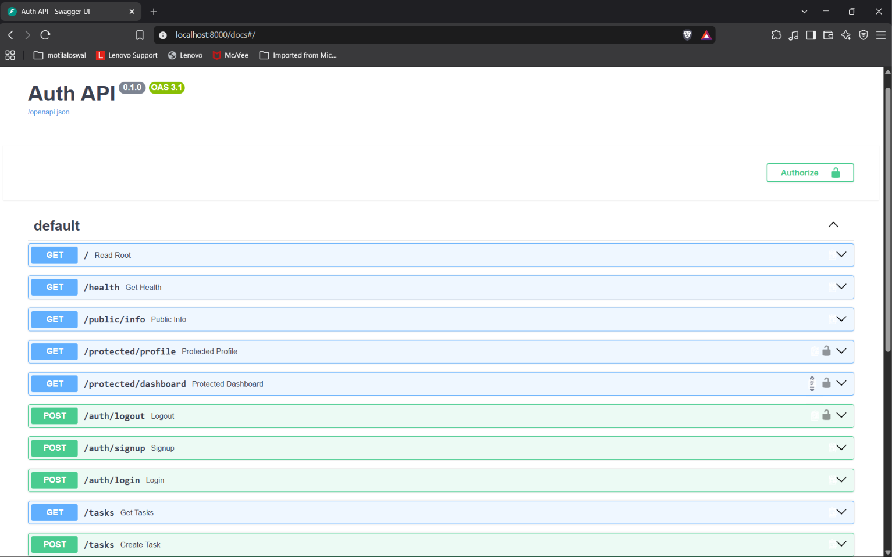

# Secure Auth API (FastAPI & Supabase)

This is a secure REST API built with FastAPI that handles user authentication using Supabase Auth as the Identity Provider. It issues JSON Web Tokens (JWTs), verifies them to guard protected routes, and documents the flow using Swagger UI.

## How to Run

1. **Set your environment variables:**
   Copy the provided example file to create your local `.env` configuration, and add your Supabase credentials:
   ```bash
   cp .env.example .env
   ```

2. **Start the server:**
   Bring up the FastAPI server with a single command:
   ```bash
   uvicorn main:app
   ```
   *The API will be running at [http://127.0.0.1:8000](http://127.0.0.1:8000).*

## API Reference

| Method | Endpoint | Auth Required | Purpose |
|--------|----------|---------------|---------|
| POST | `/auth/signup` | No | Create a new user account |
| POST | `/auth/login` | No | Authenticate & return a JWT |
| POST | `/auth/logout` | Yes (Bearer) | End the user's session |
| GET | `/protected/profile` | Yes (Bearer) | Read private profile data |
| GET | `/public/info` | No | Read public, open data |

## Swagger UI Documentation

This API is fully documented with an interactive Swagger UI, featuring built-in Bearer token authorization via FastAPI's `HTTPBearer` scheme.

