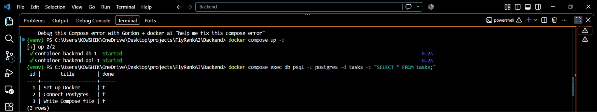

# Task API (Containerized PostgreSQL)

This is a RESTful CRUD API built with FastAPI, fully containerized using Docker, and backed by a real PostgreSQL database. 

## How to Run

1. **Set your environment variables:**
   Copy the provided example file to create your local `.env` configuration (this sets the database password):
   ```bash
   cp .env.example .env
   ```

2. **Start the stack:**
   Bring up both the Python API and the PostgreSQL database with a single command:
   ```bash
   docker compose up -d
   ```
   *The API will now be running at http://localhost:3000.*

---

## 🛠️ Tech Stack
* **Language:** Python
* **Framework:** FastAPI
* **Server:** Uvicorn
* **Database:** PostgreSQL (Containerized)
* **Infrastructure:** Docker & Docker Compose

---

## 🗄️ Database
This API utilizes a real **PostgreSQL** database running inside a Docker container. A Docker volume is mounted to ensure that all tasks survive container deletions and server restarts.



## Example Request
Running a test request against the API using cURL:

```bash
$ curl -i http://localhost:3000/tasks

HTTP/1.1 200 OK
date: Sat, 29 Aug 2026 16:45:00 GMT
server: uvicorn
content-length: 125
content-type: application/json

[
  {"id":1,"title":"Set up Docker","done":true},
  {"id":2,"title":"Connect Postgres","done":false},
  {"id":3,"title":"Write Compose file","done":false}
]
```