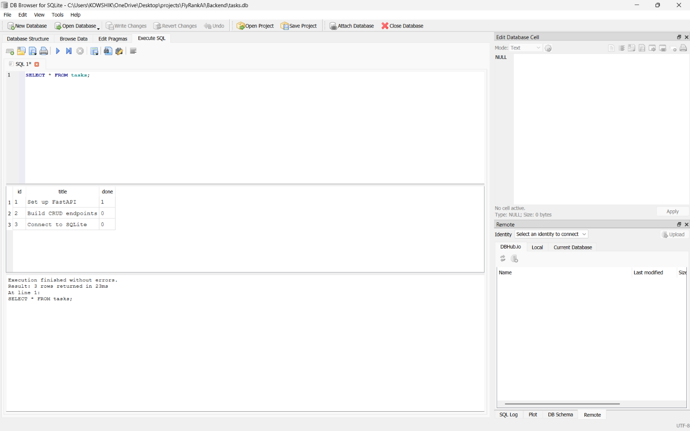

# Task API - FlyRank Internship Backend Track

*Built by **Gandikota Sai Kowshik***

A lightning-fast, in-memory RESTful CRUD API built for managing to-do lists. Designed with **Python** and **FastAPI**, this backend handles task creation, updates, and deletions with strict data validation and automatic interactive documentation.

---

## 🛠️ Tech Stack
* **Language:** Python
* **Framework:** FastAPI
* **Server:** Uvicorn

---
## 🗄️ Database
This API utilizes **SQLite** for persistent storage. SQLite was chosen because it requires zero setup, stores data in a single local file (`tasks.db`), and ensures tasks survive server restarts.

* **Example SQL Query executed:** `SELECT * FROM tasks WHERE done = 1;` (Returns all completed tasks).



## ⚡ How to Install & Run

Get the server up and running on your local machine in seconds. 

```bash
pip install fastapi uvicorn pydantic
uvicorn main:app --reload

